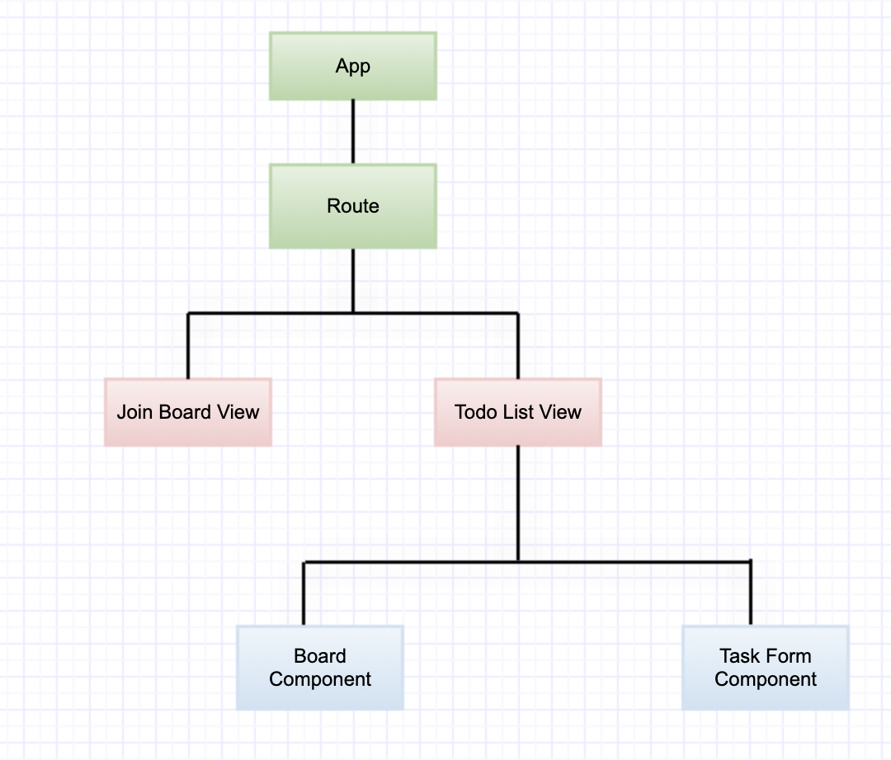

# Design Document: Todo.io

## Overview

This simple project is about adding the tasks in todo list board and view it by any user who joins the board.

### Views and Components

## Context

### Goal

Team members can use this app to track non ticket/not tracked work in which team involved during sprint.

### Problem Statement

1. Editing the existing todo is not allowed
2. There is no space to add comments about the progress
3. No track of ongoing work about the todo list added and what’s its progress.
4. User can’t select different colors

### Proposed solution

1. Add feature to edit the existing todo
2. Add comment section at end of the each todo list which allows user to add multiple comments.
3. Add coverage dropdown where user can select number (in %) to show the percentage of completion.
4. Add color palette for selection so users can interact better with app.

## Shakeholders:

Suriyadevi Varatharaju (Development)
